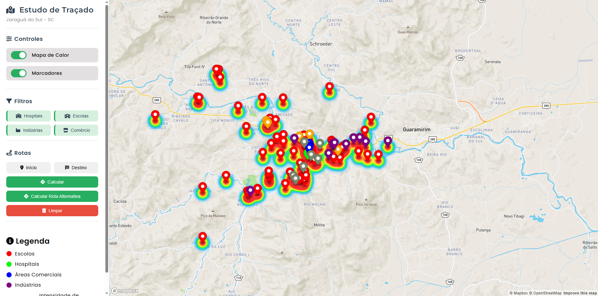

# 🚦 Traffic Flow Analysis - Jaraguá do Sul

## 🚧 Status do Projeto


**Visualização e gerenciamento de tráfego urbano**  
Um sistema completo para análise de padrões de tráfego, gerenciamento de vias e planejamento urbano em Jaraguá do Sul/SC.

## 

## ✨ Funcionalidades (em desenvolvimento)

- ✅ **Gerenciamento de vias** (etapa atual):
- Mapa de calor de intensidade de tráfego
- Filtros dinâmicos por tipo de local (hospitais, escolas, indústrias)
- Cálculo de rotas (principal e alternativa)
- Integração completa com banco de dados PostgreSQL + PostGIS

> 🔧 Funcionalidades futuras:

- Visualização por tipo de pavimentação (asfalto, terra, paralelepípedo)
- Importação de rotas do Google Earth (`.kml`, `.gpx`)
- Edição e criação de novas ruas

---

## 🛠 Tecnologias

### Frontend

- [Mapbox GL JS](https://docs.mapbox.com/mapbox-gl-js/) (mapas interativos)
- [Turf.js](https://turfjs.org/) (análise geoespacial)
- Vanilla JavaScript + HTML/CSS

### Backend

- Node.js (Express)
- PostgreSQL + PostGIS (banco de dados espacial)

### APIs

- Mapbox Directions API (cálculo de rotas)
- Mapbox Geocoding API (busca de endereços)

---

## 🚀 Como Executar

### ✅ Pré-requisitos

- Node.js (v18+)
- PostgreSQL com **PostGIS** ativado
- Conta no [Mapbox](https://www.mapbox.com/) com token de acesso

### 📦 Passo a Passo

1. **Clone o repositório**

   ```bash
   git clone https://github.com/seu-usuario/jaragua-traffic-analysis.git
   cd jaragua-traffic-analysis

   ```

2. **Crie um arquivo .env na raiz do projeto:**

   ```bash
   env
   Copiar
   Editar
   MAPBOX_ACCESS_TOKEN=seu_token_mapbox
   DB_HOST=localhost
   DB_PORT=5432
   DB_USER=postgres
   DB_PASSWORD=sua_senha
   DB_NAME=jaragua_traffic
   ```

3. **Instale dependencias**

   ```bash
   npm install
   ```

4. **Inicie o servidor**

   ```bash
   npm start
   ```

5. **Abra no navegador**

   ```bash
   Abra no navegador:
   http://localhost:3000
   ```
